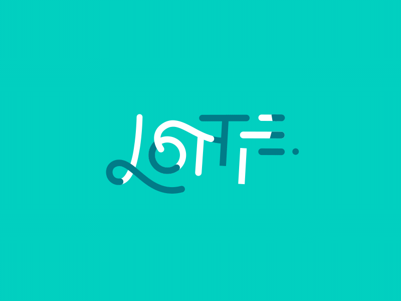

# Lottie Animations



## Summary
Basic support of Lottie animations

See following link for more information:
* UWP: https://github.com/azchohfi/LottieUWP
* iOS: https://github.com/airbnb/lottie-ios
* Android: https://github.com/airbnb/lottie-android

It's really important to follow performance guidelines.
In case you are not able to see your animation, compare by testing with an another existing json file.
If your code is working fine with another json file you need to check with Design if they are not using unsupported after effects features.

## Old Format
 Lottie introduced a big optimisation on the json export of the animation (reducing the size of the file by ~30%). This update is "breaking", so until we update the underlying lottie packages (native ones) to 3.0+, we need to make sure to export the animation using the old format.

 In the BodyMoving settings (in AfterEffects) under `Advanced export features` you must activate `Export old json format (for backwards compatibility)`.

 If you don't, you'll get runtime error `Missing values for keyframe` (or other errors).
 
 [More info](https://github.com/airbnb/lottie-android/issues/1177#issuecomment-481635211)

## Supported features per platform for Design
https://airbnb.io/lottie/#/supported-features

## Performance guidelines for Design
* Android: https://airbnb.io/lottie/#/android?id=performance
* iOS: https://airbnb.io/lottie/#/ios
* UWP : https://github.com/azchohfi/LottieUWP#performance-and-memory

## Currently Unsupported After Effects Features for Design
*	Merge Shapes
*	Alpha Inverted Masks
*	Trim Shapes Individually feature of Trim Paths
*	Expressions
*	3d Layer support
*	Time remapping / Layer Reverse
*	Layer Blend Modes
*	Layer Effects
*Verify github readme info per platform for the latest changes*

## Platform support

| Feature                                 | UWA | Android       | iOS |
| --------------------------------------- |:---:|:-------------:|:---:|
| Autoplay                                |  X  |  X            |  X  |
| Loop                                    |  X  |  X            |  X  |
| Enable or disable hardware acceleration |  X  |  X            |  -  |
| Enable or disable merge paths           |  -  |  X (KitKat+)  |  -  |
| Image support                           |  -  |  -            |  -  |
| Animation progress                      |  -  |  -            |  -  |
| Animation speed                         |  -  |  -            |  -  |
| Animation reverse                       |  X  |  X            |  X  |
| Interactions                            |  -  |  -            |  -  |
| Play from/to frame                      |  -  |  -            |  -  |
| Play from/to progress                   |  X  |  X            |  X  |
| Maximum animation progress              |  X  |  X            |  X  |
| Minimum animation progress              |  X  |  X            |  X  |
| ... *and more to come*                  |  -  |  -            |  -  |

## Usage

1. Add a reference to Umbrella.View.Lottie to iOS, Android and UWP project heads

1. Import JSON animation file into project

    > Build action for animation file must be 
    > * AndroidAsset on Android
    > * BundleResource on iOS
    > * Content on UWP

    For Android, you may need to store your .json and .png files in another nested "Assets" folder, like Assets/Assets/Animations.

1. Add the required namespace into the XAML file

	```
	xmlns:lottie="using:Umbrella.View.Lottie"
	```
	
1. To display animation, simply use

    ```
   <lottie:Animation FileName="Assets/Animations/Gears.json" 
				  AutoPlay="True" 
				  Loop="True"
				  android:Scale="0.25"
				  Height="180"
				  Width="320"
				  HorizontalAlignment="Center"
				  VerticalAlignment="Center" />
    ```
1. If your animation consists of a series of images, use the ImageAssetsFolder property like so:

	```
	<lottie:Animation FileName="Assets/Animations/LoadingAnimation.json"
				  AutoPlay="True"
				  Loop="True"
				  Height="180"
				  Width="320"
				  HorizontalAlignment="Center"
				  VerticalAlignment="Center"
				  ImageAssetsFolder="Assets/Animations"/>
	```	

    Usually, the Assets folder is into the same folder as the json file.
    On iOS, the property exists but is not used, it will find the folder by itself.

## Known issues

* No scale to fit on Android
* Image support is not currently well supported across platforms

## Current Lottie Version
* UWP: 2.2.5-beta1
* iOS: 2.1.3
* Android 7.1: 2.2.5
* Android 8.0: 2.5.0
